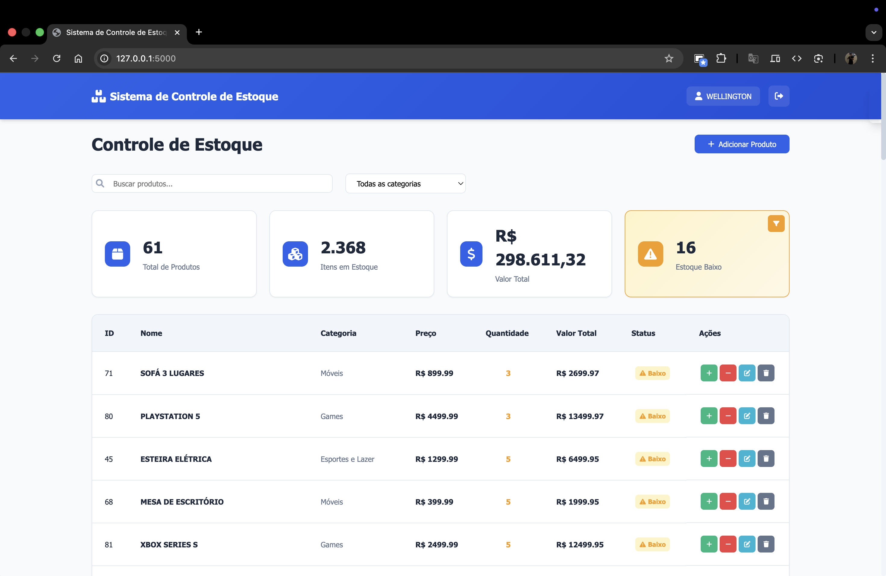

# Sistema de Controle de Estoque

Este repositório contém uma aplicação web simples para gestão de produtos e estoque. A aplicação possui um backend em Flask e um front-end estático (HTML/JS/CSS).

### Este projeto foi desenvolvido como trabalho acadêmico para a faculdade.

## Sobre

Aplicação de controle de estoque pensada para pequenos comércios, vendedores autônomos e estabelecimentos que precisam gerenciar produtos, quantidades e validade de forma simples. Também serve como projeto didático para estudantes que estão aprendendo a integrar Flask com um front-end estático e persistência em SQLite.

## Principais benefícios:
- Permite registrar produtos, acompanhar entradas e saídas de estoque e localizar itens próximos do fim do estoque.
- Interface simples para funcionários ou gerentes locais.
- Fácil de rodar localmente e adaptar a negócios pequenos.

## Capturas de Tela

Galeria de capturas disponíveis em `docs/`:

<table>
   <tr>
      <td align="center">
         
          Tela de login
      </td>
      <td align="center">
         
          Tela principal
      </td>
   </tr>

   <tr>
      <td align="center">
         
          Filtro (baixo estoque)
      </td>
      <td align="center">
         
          Categorias
      </td>
   </tr>
   <tr>
      <td align="center">
         
          Tela principal (variante)
      </td>
      <td align="center">
         
          Produto cadastrado
      </td>
   </tr>
   <tr>
      <td align="center">
         
          Entrada de produto
      </td>
      <td align="center">
         
          Saída de produto
      </td>
   </tr>
   <tr>
      <td align="center">
         
          Editar produto
      </td>
      <td align="center">
         
          Excluir produto
      </td>
   </tr>
</table>

## Principais funcionalidades:
- Autenticação de usuários (login/registro)
- CRUD de produtos
- Controle de entradas/saídas de estoque
- Listagem de categorias e informações do usuário

## Estrutura do projeto

- `backend/` — código do servidor Flask
  - `app.py` — ponto de entrada do backend (inicia o servidor)
  - `db_produto.py`, `db_usuario.py` — acesso ao SQLite e funções de persistência
  - `estoque.db`, `usuario.db` — bancos SQLite usados pela aplicação
- `front-end/` — arquivos estáticos e templates usados pelo Flask
  - `templates/` — `index.html`, `login.html`
  - `static/` — CSS e JS (ex: `static/js/app.js`)
- `requirements.txt` — dependências Python
- `README.md` — este arquivo

## Como rodar a aplicação (local)

1. Clone o repositório:

   git clone https://github.com/wellingtonbarbosadev/sistema-controle-estoque.git
   cd sistema-controle-estoque

2. Crie e ative um ambiente virtual (recomendado):

   # macOS / Linux
   python -m venv venv
   source venv/bin/activate

   # Windows (PowerShell)
   python -m venv venv
   .\venv\Scripts\Activate.ps1

3. Instale as dependências:

   pip install -r requirements.txt

4. Inicie o backend (o servidor Flask usa os templates e static de `front-end`):

   python backend/app.py

5. Abra o navegador em http://127.0.0.1:5000 e acesse a aplicação. Use `admin@example.com` e `senha123` para se autenticar.

## Dependências

As dependências estão listadas em `requirements.txt` (Flask, pandas, etc.).

## Contato

Se precisar de ajuda com execução ou quiser melhorias, abra uma issue ou entre em contato com o mantenedor.